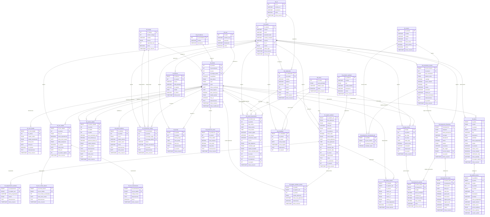

# Diagrama ERD — BD_Hofloc_Gestion (Sistema Ganadero HOFLOC.SA)

```mermaid
erDiagram

    %% ── SEGURIDAD ──────────────────────────────────────────────────────────────

    tbl_rol {
        INT id_rol PK
        VARCHAR nombre_rol
        VARCHAR descripcion
        BOOLEAN activo
        TIMESTAMP fecha_creacion
    }

    tbl_usuario {
        INT id_usuario PK
        VARCHAR usuario
        VARCHAR email
        VARCHAR password_hash
        VARCHAR nombre_completo
        VARCHAR telefono
        INT id_rol FK
        ENUM estado
        DATETIME ultimo_login
        TIMESTAMP fecha_creacion
        TIMESTAMP fecha_modif
    }

    tbl_colaborador {
        INT id_colaborador PK
        INT id_usuario FK
        VARCHAR nombre
        VARCHAR telefono
        VARCHAR correo
        INT id_rol FK
        ENUM estado
        TEXT notas
        DATE fecha_ingreso
        TIMESTAMP fecha_creacion
    }

    %% ── CATÁLOGOS BASE ─────────────────────────────────────────────────────────

    tbl_raza {
        INT id_raza PK
        VARCHAR nombre_raza
        ENUM proposito
        VARCHAR descripcion
        BOOLEAN activo
    }

    tbl_procedencia {
        INT id_procedencia PK
        VARCHAR nombre
        VARCHAR descripcion
    }

    tbl_manga {
        INT id_manga PK
        INT numero_manga
        VARCHAR nombre
        ENUM funcion
        INT capacidad_max
        BOOLEAN activo
        TIMESTAMP fecha_creacion
    }

    tbl_causa {
        INT id_causa PK
        ENUM causa_principal
        VARCHAR detalle_causa
        BOOLEAN activo
        TIMESTAMP fecha_creacion
    }

    %% ── ANIMALES ───────────────────────────────────────────────────────────────

    tbl_animal {
        INT id_animal PK
        INT id_procedencia FK
        INT id_raza FK
        INT id_manga_actual FK
        VARCHAR trazabilidad
        ENUM tipo_animal
        ENUM sexo
        VARCHAR arete
        DATE fecha_nacimiento
        DATE fecha_ingreso
        DECIMAL peso_actual_kg
        ENUM estado_animal
        VARCHAR foto_url
        TEXT observaciones
        TIMESTAMP fecha_creacion
        TIMESTAMP fecha_modificacion
    }

    tbl_vaca_detalle {
        BIGINT id_vaca_detalle PK
        INT id_animal FK
        ENUM estado_ordeno
        ENUM estado_reproductivo
        DATE fecha_inicio
        DATE fecha_fin
        BOOLEAN es_vigente
        TEXT observaciones
        TIMESTAMP fecha_creacion
    }

    tbl_toro_detalle {
        BIGINT id_toro_detalle PK
        INT id_animal FK
        ENUM tipo_uso
        BOOLEAN activo_reproduccion
        DATE fecha_inicio_reprod
        ENUM libido_evaluacion
        BOOLEAN es_vigente
        DATE fecha_inicio
        DATE fecha_fin
        INT id_usuario_registro FK
        TIMESTAMP fecha_creacion
    }

    tbl_toro_monta_natural {
        BIGINT id_monta_natural PK
        BIGINT id_toro_detalle FK
        INT num_montas_acumuladas
        DATE fecha_inicio_monta
        TEXT observaciones
        TIMESTAMP fecha_creacion
    }

    tbl_toro_inseminacion {
        BIGINT id_inseminacion PK
        BIGINT id_toro_detalle FK
        CHAR codigo_envase
        TEXT observaciones
        BOOLEAN activo
        TIMESTAMP fecha_creacion
    }

    tbl_ternero_detalle {
        BIGINT id_ternero_detalle PK
        INT id_animal FK
        INT id_madre FK
        INT id_padre FK
        DECIMAL peso_nacimiento_kg
        DECIMAL peso_destete_kg
        DECIMAL ganancia_diaria_kg
        ENUM estado_lactancia
        DATE fecha_destete
        TEXT observaciones
        BOOLEAN es_vigente
        DATE fecha_inicio
        DATE fecha_fin
        TIMESTAMP fecha_creacion
    }

    tbl_animal_auditoria {
        BIGINT id_auditoria PK
        INT id_animal FK
        ENUM accion
        VARCHAR estado_anterior
        VARCHAR estado_nuevo
        VARCHAR motivo
        TEXT observaciones
        DATE fecha_evento
        TIMESTAMP fecha_creacion
    }

    %% ── MOVIMIENTOS DE MANGA ───────────────────────────────────────────────────

    tbl_movimiento_manga {
        BIGINT id_movimiento PK
        INT id_animal FK
        INT id_manga_origen FK
        INT id_manga_destino FK
        VARCHAR motivo
        DATETIME fecha_movimiento
        INT id_usuario FK
        TEXT observaciones
        TIMESTAMP fecha_creacion
    }

    %% ── PESAJE ─────────────────────────────────────────────────────────────────

    tbl_pesaje {
        BIGINT id_pesaje PK
        INT id_animal FK
        DATE fecha_pesaje
        TIME hora_pesaje
        DECIMAL peso_kg
        TEXT observaciones
        INT id_usuario FK
        TIMESTAMP fecha_creacion
    }

    %% ── PRODUCCIÓN DE LECHE ────────────────────────────────────────────────────

    tbl_produccion_leche {
        BIGINT id_produccion PK
        INT id_animal FK
        DATE fecha_ordeno
        DECIMAL litros_manana
        DECIMAL litros_tarde
        DECIMAL total_litros
        TEXT observaciones
        TIMESTAMP fecha_creacion
    }

    %% ── GESTIÓN SANITARIA ──────────────────────────────────────────────────────

    tbl_producto_sanitario {
        INT id_producto PK
        VARCHAR nombre
        ENUM tipo
        VARCHAR unidad_medida
        VARCHAR descripcion
        BOOLEAN activo
        TIMESTAMP fecha_creacion
    }

    tbl_registro_sanitario {
        BIGINT id_registro_san PK
        ENUM tipo_aplicacion
        ENUM categoria
        VARCHAR sub_tipo
        ENUM proposito
        INT id_producto FK
        DECIMAL dosis_valor
        ENUM dosis_unidad
        DATE fecha_aplicacion
        TIME hora_aplicacion
        ENUM repeticion
        INT intervalo_dias
        INT duracion_dias
        INT id_causa FK
        VARCHAR responsable
        TEXT notas
        INT id_veterinario FK
        INT id_usuario FK
        TIMESTAMP fecha_creacion
    }

    tbl_registro_sanitario_animal {
        BIGINT id_detalle PK
        BIGINT id_registro_san FK
        INT id_animal FK
        ENUM estado_aplicacion
        DATETIME fecha_real_aplicacion
        VARCHAR observacion
        TIMESTAMP fecha_creacion
    }

    tbl_mastitis_cuartos {
        BIGINT id_mastitis PK
        BIGINT id_registro_san FK
        INT id_animal FK
        ENUM cuarto_ad
        ENUM cuarto_pd
        ENUM cuarto_ai
        ENUM cuarto_pi
        TEXT notas_diagnostico
        BOOLEAN en_tratamiento
        TIMESTAMP fecha_creacion
    }

    tbl_programacion_sanitaria {
        BIGINT id_programacion PK
        BIGINT id_registro_san FK
        DATETIME fecha_programada
        ENUM estado
        TEXT observaciones
        TIMESTAMP fecha_creacion
    }

    %% ── REPRODUCCIÓN ───────────────────────────────────────────────────────────

    tbl_evento_reproductivo {
        BIGINT id_evento_rep PK
        INT id_animal FK
        ENUM tipo_evento
        DATE fecha_evento
        TIME hora_evento
        VARCHAR numero_pajilla
        VARCHAR raza_semen
        VARCHAR proveedor_semen
        INT id_toro FK
        ENUM fase_palpacion
        ENUM resultado_palp
        ENUM estado_resultado
        DATE fecha_estimada_parto
        INT id_causa FK
        TEXT observaciones
        INT id_veterinario FK
        INT id_usuario FK
        TIMESTAMP fecha_creacion
    }

    %% ── MORTALIDAD / BAJAS ─────────────────────────────────────────────────────

    tbl_mortalidad {
        BIGINT id_mortalidad PK
        INT id_animal FK
        INT id_causa FK
        DATE fecha_muerte
        TIMESTAMP fecha_registro
        TEXT observacion
        INT id_usuario FK
    }

    tbl_baja_animal {
        BIGINT id_baja PK
        INT id_animal FK
        ENUM tipo_baja
        INT id_causa FK
        DATE fecha_baja
        DECIMAL precio_venta
        VARCHAR comprador
        TEXT observacion
        INT id_usuario FK
        TIMESTAMP fecha_creacion
    }

    %% ── INSUMOS ────────────────────────────────────────────────────────────────

    tbl_insumo {
        INT id_insumo PK
        VARCHAR nombre
        VARCHAR unidad
        VARCHAR icono
        DECIMAL stock_actual
        DECIMAL stock_minimo
        BOOLEAN activo
        TIMESTAMP fecha_creacion
    }

    tbl_movimiento_insumo {
        BIGINT id_mov_insumo PK
        INT id_insumo FK
        ENUM tipo_movimiento
        ENUM destino_venta
        DECIMAL cantidad
        DECIMAL precio_unitario
        DECIMAL total
        VARCHAR cliente
        VARCHAR proveedor
        VARCHAR factura_url
        DATE fecha_movimiento
        TEXT observaciones
        INT id_usuario FK
        TIMESTAMP fecha_creacion
    }

    tbl_produccion_concentrado_det {
        BIGINT id_detalle PK
        BIGINT id_mov_insumo FK
        INT id_insumo_usado FK
        DECIMAL cantidad_usada
    }

    %% ── FINANZAS ───────────────────────────────────────────────────────────────

    tbl_transaccion_financiera {
        BIGINT id_transaccion PK
        ENUM categoria
        DATE fecha_transaccion
        VARCHAR concepto
        TEXT descripcion
        DECIMAL monto
        ENUM estado
        VARCHAR url_factura
        ENUM tipo_origen
        BIGINT id_mov_insumo FK
        INT id_usuario FK
        TIMESTAMP fecha_creacion
    }

    tbl_transaccion_animal {
        BIGINT id_trans_animal PK
        BIGINT id_transaccion FK
        BIGINT id_baja FK
        DECIMAL precio_acordado
        DECIMAL comision_pct
        DECIMAL comision_monto
        DECIMAL neto_recibido
        VARCHAR notas
        TIMESTAMP fecha_creacion
    }

    tbl_transaccion_leche {
        BIGINT id_trans_leche PK
        BIGINT id_transaccion FK
        DATE fecha_inicio
        DATE fecha_fin
        DECIMAL total_litros
        DECIMAL precio_litro
        DECIMAL descuentos
        DECIMAL ingreso_bruto
        DECIMAL ingreso_neto
        VARCHAR comprador
        VARCHAR notas
        TIMESTAMP fecha_creacion
    }

    %% ── ALERTAS ────────────────────────────────────────────────────────────────

    tbl_alerta {
        BIGINT id_alerta PK
        ENUM modulo
        INT id_animal FK
        BIGINT id_origen
        VARCHAR tipo
        TEXT descripcion
        ENUM prioridad
        DATE fecha_programada
        ENUM estado
        VARCHAR url_destino
        BOOLEAN enviar_correo
        BOOLEAN correo_enviado
        BOOLEAN notificacion_vista
        DATETIME fecha_atendida
        INT id_usuario_atiende FK
        TIMESTAMP fecha_creacion
    }

    tbl_auditoria_alerta {
        BIGINT id_auditoria PK
        BIGINT id_alerta FK
        VARCHAR modulo
        INT id_animal
        BIGINT id_origen
        VARCHAR tipo
        TEXT descripcion
        VARCHAR prioridad
        DATE fecha_programada
        VARCHAR estado_anterior
        VARCHAR estado_nuevo
        ENUM accion_auditoria
        TIMESTAMP fecha_auditoria
        VARCHAR usuario_auditor
    }

    %% ── BITÁCORA ───────────────────────────────────────────────────────────────

    tbl_bitacora {
        BIGINT id_bitacora PK
        INT id_usuario FK
        VARCHAR accion
        VARCHAR tabla_afectada
        VARCHAR id_registro
        JSON detalle
        VARCHAR ip_cliente
        TIMESTAMP fecha_accion
    }

    %% ════════════════════════════════════════════════════════════════════════════
    %%  RELACIONES
    %% ════════════════════════════════════════════════════════════════════════════

    %% Seguridad
    tbl_rol         ||--o{ tbl_usuario       : "tiene"
    tbl_rol         ||--o{ tbl_colaborador   : "asignado a"
    tbl_usuario     ||--o| tbl_colaborador   : "vinculado a"

    %% Animal → catálogos
    tbl_raza        ||--o{ tbl_animal        : "pertenece a"
    tbl_procedencia ||--o{ tbl_animal        : "origen de"
    tbl_manga       ||--o{ tbl_animal        : "ubicado en"

    %% Detalles del animal
    tbl_animal      ||--o{ tbl_vaca_detalle         : "historial vaca"
    tbl_animal      ||--o{ tbl_toro_detalle         : "historial toro"
    tbl_animal      ||--o{ tbl_ternero_detalle      : "historial ternero"
    tbl_animal      ||--o{ tbl_animal_auditoria     : "auditado en"

    %% Parentesco ternero
    tbl_animal      ||--o{ tbl_ternero_detalle      : "madre de"
    tbl_animal      ||--o{ tbl_ternero_detalle      : "padre de"

    %% Toro sub-detalles
    tbl_toro_detalle ||--o| tbl_toro_monta_natural  : "monta natural"
    tbl_toro_detalle ||--o{ tbl_toro_inseminacion   : "inseminación"
    tbl_usuario      ||--o{ tbl_toro_detalle        : "registra"

    %% Movimientos de manga
    tbl_animal      ||--o{ tbl_movimiento_manga     : "se mueve"
    tbl_manga       ||--o{ tbl_movimiento_manga     : "manga origen"
    tbl_manga       ||--o{ tbl_movimiento_manga     : "manga destino"
    tbl_usuario     ||--o{ tbl_movimiento_manga     : "registra"

    %% Pesaje
    tbl_animal      ||--o{ tbl_pesaje               : "pesado en"
    tbl_usuario     ||--o{ tbl_pesaje               : "registra"

    %% Producción de leche
    tbl_animal      ||--o{ tbl_produccion_leche     : "produce"

    %% Sanitario
    tbl_producto_sanitario  ||--o{ tbl_registro_sanitario          : "aplicado en"
    tbl_causa               ||--o{ tbl_registro_sanitario          : "causa"
    tbl_colaborador         ||--o{ tbl_registro_sanitario          : "veterinario"
    tbl_usuario             ||--o{ tbl_registro_sanitario          : "registra"
    tbl_registro_sanitario  ||--o{ tbl_registro_sanitario_animal   : "incluye animal"
    tbl_animal              ||--o{ tbl_registro_sanitario_animal   : "recibe tratamiento"
    tbl_registro_sanitario  ||--o{ tbl_mastitis_cuartos            : "diagnóstico"
    tbl_animal              ||--o{ tbl_mastitis_cuartos            : "diagnosticada"
    tbl_registro_sanitario  ||--o{ tbl_programacion_sanitaria      : "programado"

    %% Reproducción
    tbl_animal      ||--o{ tbl_evento_reproductivo  : "participa (hembra)"
    tbl_animal      ||--o{ tbl_evento_reproductivo  : "participa (toro)"
    tbl_causa       ||--o{ tbl_evento_reproductivo  : "causa"
    tbl_colaborador ||--o{ tbl_evento_reproductivo  : "veterinario"
    tbl_usuario     ||--o{ tbl_evento_reproductivo  : "registra"

    %% Mortalidad
    tbl_animal      ||--o| tbl_mortalidad           : "fallece"
    tbl_causa       ||--o{ tbl_mortalidad           : "causa muerte"
    tbl_usuario     ||--o{ tbl_mortalidad           : "registra"

    %% Bajas
    tbl_animal      ||--o| tbl_baja_animal          : "sale del hato"
    tbl_causa       ||--o{ tbl_baja_animal          : "motivo baja"
    tbl_usuario     ||--o{ tbl_baja_animal          : "registra"

    %% Insumos
    tbl_insumo      ||--o{ tbl_movimiento_insumo            : "kardex"
    tbl_usuario     ||--o{ tbl_movimiento_insumo            : "registra"
    tbl_movimiento_insumo   ||--o{ tbl_produccion_concentrado_det : "detalle producción"
    tbl_insumo      ||--o{ tbl_produccion_concentrado_det   : "insumo usado"

    %% Finanzas
    tbl_usuario             ||--o{ tbl_transaccion_financiera   : "registra"
    tbl_movimiento_insumo   ||--o{ tbl_transaccion_financiera   : "origen compra/venta"
    tbl_transaccion_financiera ||--o{ tbl_transaccion_animal    : "detalle venta animal"
    tbl_transaccion_financiera ||--o{ tbl_transaccion_leche     : "detalle leche"
    tbl_baja_animal         ||--o{ tbl_transaccion_animal       : "genera ingreso"

    %% Alertas
    tbl_animal      ||--o{ tbl_alerta               : "genera alerta"
    tbl_usuario     ||--o{ tbl_alerta               : "atiende alerta"
    tbl_alerta      ||--o{ tbl_auditoria_alerta     : "auditada en"

    %% Bitácora
    tbl_usuario     ||--o{ tbl_bitacora             : "genera log"
```
