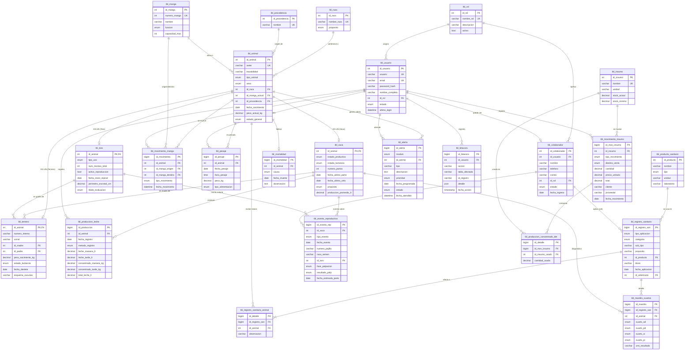

```mermaid
erDiagram

    %% =============================================================
    %%   HOFLOC.SA — DIAGRAMA ENTIDAD-RELACIÓN
    %%   Patrón Class-Table-Inheritance para tipos de animal
    %% =============================================================

    tbl_rol ||--o{ tbl_usuario       : "asigna"
    tbl_rol ||--o{ tbl_colaborador   : "tipifica"
    tbl_usuario ||--o| tbl_colaborador : "puede ser"

    tbl_raza        ||--o{ tbl_animal : "pertenece a"
    tbl_procedencia ||--o{ tbl_animal : "origen de"
    tbl_manga       ||--o{ tbl_animal : "ubica a"

    %% Herencia 1:1 (Class Table Inheritance)
    tbl_animal ||--o| tbl_vaca    : "ES-UN (Vaca)"
    tbl_animal ||--o| tbl_toro    : "ES-UN (Toro)"
    tbl_animal ||--o| tbl_ternero : "ES-UN (Ternero)"

    %% Genealogía
    tbl_vaca ||--o{ tbl_ternero : "es madre de"
    tbl_toro ||--o{ tbl_ternero : "es padre de"

    %% Movimientos
    tbl_animal ||--o{ tbl_movimiento_manga : "se mueve"
    tbl_manga  ||--o{ tbl_movimiento_manga : "origen/destino"
    tbl_usuario ||--o{ tbl_movimiento_manga : "registra"

    %% Pesaje
    tbl_animal  ||--o{ tbl_pesaje : "es pesado"
    tbl_usuario ||--o{ tbl_pesaje : "registra"

    %% Producción de leche (solo vacas)
    tbl_vaca    ||--o{ tbl_produccion_leche : "produce"
    tbl_usuario ||--o{ tbl_produccion_leche : "registra"

    %% Sanitaria
    tbl_producto_sanitario ||--o{ tbl_registro_sanitario       : "se usa en"
    tbl_colaborador        ||--o{ tbl_registro_sanitario       : "aplica (vet)"
    tbl_registro_sanitario ||--|{ tbl_registro_sanitario_animal : "afecta a"
    tbl_animal             ||--o{ tbl_registro_sanitario_animal : "recibe tratam."
    tbl_registro_sanitario ||--o{ tbl_mastitis_cuartos          : "detalla"
    tbl_vaca               ||--o{ tbl_mastitis_cuartos          : "diagnóstico"

    %% Reproducción
    tbl_vaca        ||--o{ tbl_evento_reproductivo : "evento sobre"
    tbl_toro        ||--o{ tbl_evento_reproductivo : "monta natural"
    tbl_colaborador ||--o{ tbl_evento_reproductivo : "atiende"

    %% Mortalidad (1:1)
    tbl_animal ||--o| tbl_mortalidad : "fallece"

    %% Insumos
    tbl_insumo  ||--o{ tbl_movimiento_insumo            : "se mueve"
    tbl_usuario ||--o{ tbl_movimiento_insumo            : "registra"
    tbl_movimiento_insumo ||--o{ tbl_produccion_concentrado_det : "compone"
    tbl_insumo  ||--o{ tbl_produccion_concentrado_det   : "usado en"

    %% Alertas y bitácora
    tbl_animal  ||--o{ tbl_alerta : "genera alerta"
    tbl_usuario ||--o{ tbl_alerta : "atiende"
    tbl_usuario ||--o{ tbl_bitacora : "registra"

    %% =============================================================
    %%   ATRIBUTOS PRINCIPALES POR ENTIDAD
    %% =============================================================

    tbl_rol {
        int     id_rol PK
        varchar nombre_rol UK
        varchar descripcion
        bool    activo
    }

    tbl_usuario {
        int     id_usuario PK
        varchar usuario UK
        varchar email UK
        varchar password_hash
        varchar nombre_completo
        int     id_rol FK
        enum    estado
        datetime ultimo_login
    }

    tbl_colaborador {
        int     id_colaborador PK
        int     id_usuario FK
        varchar nombre
        varchar telefono
        varchar correo
        int     id_rol FK
        enum    estado
        date    fecha_ingreso
    }

    tbl_raza {
        int     id_raza PK
        varchar nombre_raza UK
        enum    proposito
    }

    tbl_procedencia {
        int     id_procedencia PK
        varchar nombre UK
    }

    tbl_manga {
        int     id_manga PK
        int     numero_manga UK
        varchar nombre
        enum    funcion
        int     capacidad_max
    }

    tbl_animal {
        int     id_animal PK
        varchar arete UK
        varchar trazabilidad
        enum    tipo_animal
        enum    sexo
        int     id_raza FK
        int     id_manga_actual FK
        int     id_procedencia FK
        date    fecha_nacimiento
        decimal peso_actual_kg
        enum    estado_general
    }

    tbl_vaca {
        int     id_animal PK,FK
        enum    estado_productivo
        enum    estado_lactancia
        int     numero_partos
        date    fecha_ultimo_parto
        date    fecha_ultimo_celo
        enum    proposito
        decimal produccion_promedio_lt
    }

    tbl_toro {
        int     id_animal PK,FK
        enum    tipo_uso
        int     num_montas_total
        bool    activo_reproduccion
        date    fecha_inicio_reprod
        decimal perimetro_escrotal_cm
        enum    libido_evaluacion
    }

    tbl_ternero {
        int     id_animal PK,FK
        varchar numero_interno
        varchar corral
        int     id_madre FK
        int     id_padre FK
        decimal peso_nacimiento_kg
        enum    estado_lactancia
        date    fecha_destete
        varchar esquema_vacunas
    }

    tbl_movimiento_manga {
        bigint  id_movimiento PK
        int     id_animal FK
        int     id_manga_origen FK
        int     id_manga_destino FK
        enum    tipo_movimiento
        datetime fecha_movimiento
    }

    tbl_pesaje {
        bigint  id_pesaje PK
        int     id_animal FK
        date    fecha_pesaje
        time    hora_pesaje
        decimal peso_kg
        enum    tipo_alimentacion
    }

    tbl_produccion_leche {
        bigint  id_produccion PK
        int     id_animal FK
        date    fecha_registro
        enum    metodo_registro
        decimal leche_manana_lt
        decimal leche_tarde_lt
        decimal concentrado_manana_kg
        decimal concentrado_tarde_kg
        decimal total_leche_lt
    }

    tbl_producto_sanitario {
        int     id_producto PK
        varchar nombre
        enum    tipo
        varchar unidad
        varchar laboratorio
    }

    tbl_registro_sanitario {
        bigint  id_registro_san PK
        enum    tipo_aplicacion
        enum    categoria
        varchar sub_tipo
        varchar proposito
        int     id_producto FK
        varchar dosis
        date    fecha_aplicacion
        int     id_veterinario FK
    }

    tbl_registro_sanitario_animal {
        bigint  id_detalle PK
        bigint  id_registro_san FK
        int     id_animal FK
        varchar observacion
    }

    tbl_mastitis_cuartos {
        bigint  id_mastitis PK
        bigint  id_registro_san FK
        int     id_animal FK
        enum    cuarto_ad
        enum    cuarto_pd
        enum    cuarto_ai
        enum    cuarto_pi
        varchar cmt_resultado
    }

    tbl_evento_reproductivo {
        bigint  id_evento_rep PK
        int     id_vaca FK
        enum    tipo_evento
        date    fecha_evento
        varchar numero_pajilla
        varchar raza_semen
        int     id_toro FK
        enum    fase_palpacion
        enum    resultado_palp
        date    fecha_estimada_parto
    }

    tbl_mortalidad {
        bigint  id_mortalidad PK
        int     id_animal FK
        enum    causa
        date    fecha_muerte
        text    observacion
    }

    tbl_insumo {
        int     id_insumo PK
        varchar nombre UK
        varchar unidad
        decimal stock_actual
        decimal stock_minimo
    }

    tbl_movimiento_insumo {
        bigint  id_mov_insumo PK
        int     id_insumo FK
        enum    tipo_movimiento
        enum    destino_venta
        decimal cantidad
        decimal precio_unitario
        decimal total
        varchar cliente
        varchar proveedor
        date    fecha_movimiento
    }

    tbl_produccion_concentrado_det {
        bigint  id_detalle PK
        bigint  id_mov_insumo FK
        int     id_insumo_usado FK
        decimal cantidad_usada
    }

    tbl_alerta {
        bigint  id_alerta PK
        enum    modulo
        int     id_animal FK
        varchar tipo
        text    descripcion
        enum    prioridad
        date    fecha_programada
        enum    estado
        datetime fecha_atendida
    }

    tbl_bitacora {
        bigint  id_bitacora PK
        int     id_usuario FK
        varchar accion
        varchar tabla_afectada
        varchar id_registro
        json    detalle
        timestamp fecha_accion
    }
```
